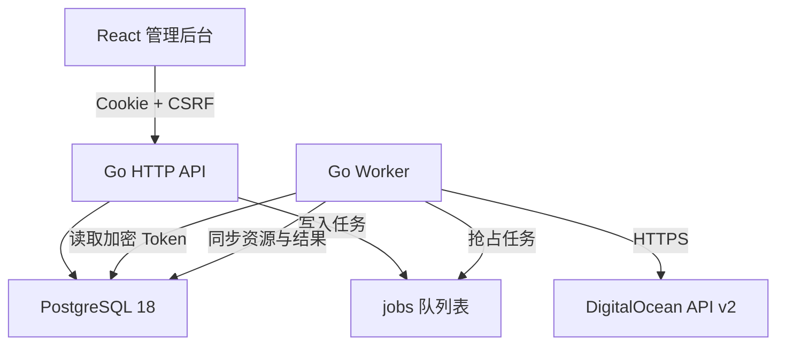

# 系统架构

Cloud Account Manager 是一个单体 API、独立 Worker 和 PostgreSQL 任务队列组成的多用户 DigitalOcean 托管系统。

## 组件职责

- `cmd/cloudmanager`：`serve`、`worker`、`migrate`、`admin`、`keygen`、`version` 命令。
- `internal/httpapi`：认证、授权、CSRF、限流、用户/管理员 API 和前端静态文件服务。
- `internal/store`：数据访问、配额统计、任务状态和审计日志。
- `internal/worker`：账号同步和云资源异步操作。
- `internal/digitalocean`：DigitalOcean API 客户端与错误映射。
- `internal/security`：Argon2id、AES-256-GCM 和一次性 Token。
- `web`：React 管理后台。

## 数据与一致性

- API 将耗时或危险操作写入 `jobs`，Worker 负责调用 DigitalOcean 并持久化结果。
- 同一 DigitalOcean Team ID 在全系统唯一，防止多个用户重复托管同一账号。
- 用户本地 Droplet、vCPU、内存配额与 DigitalOcean 官方账号配额分别统计。
- 任务状态保留排队、执行、成功、部分成功和失败结果，便于审计与重试判断。
- 数据库迁移在 API 启动和显式 `migrate` 命令中执行；生产部署必须串行。

## 安全边界

- 浏览器永远不能读取已保存的 DigitalOcean Token、SMTP 密码和托管 root 密码密文。
- 应用通过唯一 `MASTER_KEY` 加解密 AES-GCM 数据；密钥不进入数据库。
- 管理员写操作、危险实例操作和秘密读取要求近期密码验证。
- 生产 API 仅监听回环端口，由 HTTPS 反向代理对外服务。
- Worker 与 API 使用同一数据库和 `MASTER_KEY`，但 API 和 Worker 可以独立扩缩容。

当前首版只支持 DigitalOcean，不设计跨云抽象。新增云厂商前需要先明确账号身份、配额、任务幂等性和资源模型差异。
