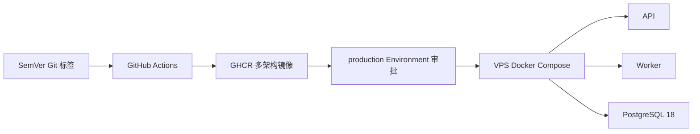

# 生产部署

推荐路线是 GitHub Actions 构建一次、推送 GHCR 不可变镜像，再由受审批的部署工作流将同一镜像部署到 VPS。生产服务器不从源码现场编译。

## 架构



## 服务器要求

- Ubuntu 24.04 或 Debian 12，`amd64`/`arm64`
- Docker Engine 和 Docker Compose v2
- `curl`、`openssh-server`、足够的数据库备份空间
- Nginx、Caddy 或其他 HTTPS 反向代理
- 非 root 部署用户，具有受控的 Docker 权限

## 首次准备

在服务器创建部署目录，例如：

```bash
sudo install -d -m 0750 -o deploy -g deploy /opt/cloud-account-manager
sudo -u deploy cp .env.production.example /opt/cloud-account-manager/.env.production
sudo -u deploy chmod 0600 /opt/cloud-account-manager/.env.production
```

编辑 `.env.production`：

```dotenv
APP_IMAGE=ghcr.io/kayungou/batchmanagementofcloudserveraccounts@sha256:...
APP_BASE_URL=https://cloud.example.com
APP_PORT=8080
POSTGRES_USER=cloudmanager
POSTGRES_PASSWORD=<使用 openssl rand -hex 32 生成>
POSTGRES_DB=cloud_account_manager
MASTER_KEY=<使用 openssl rand -base64 32 生成>
```

`.env.production` 只保存在服务器。`MASTER_KEY` 必须与数据库成对备份，已有加密数据后不得随意更换。

私有 GHCR 包需要在服务器执行一次登录，只授予 `read:packages`：

```bash
docker login ghcr.io
```

## 手工部署

把 `deploy/docker-compose.production.yml` 和 `scripts/deploy-compose.sh` 放在部署目录，然后使用镜像 digest：

```bash
cd /opt/cloud-account-manager
./scripts/deploy-compose.sh 'ghcr.io/kayungou/batchmanagementofcloudserveraccounts@sha256:<digest>'
```

脚本会串行完成：拉取镜像、启动 PostgreSQL、生成迁移前备份、执行迁移、更新 API/Worker，并检查 `/readyz`。部署失败不会自动回滚数据库。

## GitHub 审批部署

在 GitHub Settings > Environments 创建 `production`，配置 required reviewers，并设置：

Secrets：

```text
DEPLOY_HOST
DEPLOY_USER
DEPLOY_SSH_KEY
DEPLOY_KNOWN_HOSTS
```

Variables：

```text
DEPLOY_PATH=/opt/cloud-account-manager
DEPLOY_PORT=22
```

`DEPLOY_KNOWN_HOSTS` 必须从可信渠道核对服务器 SSH host key，禁止使用 `StrictHostKeyChecking=no`。部署 SSH key 应专用、可撤销，且不要授予普通 shell 之外不必要的 root 权限。

在 Actions 中运行 `Deploy production`，输入完整 GHCR digest。Environment 审批通过后，工作流会更新部署文件并调用同一个部署脚本。

## HTTPS

应用只映射到 `127.0.0.1:8080`。公网只开放 80/443，由反向代理终止 TLS：

```caddyfile
cloud.example.com {
  reverse_proxy 127.0.0.1:8080
}
```

防火墙不应公开 8080 和 5432。生产模板强制 `COOKIE_SECURE=true`，因此必须通过 HTTPS 访问。

## 升级与回滚

1. 发布新 SemVer 标签并等待 CI、Release、镜像证明全部成功。
2. 记录新镜像 digest，先在测试环境验证。
3. 触发 production 部署并确认 `/readyz`、登录和 Worker 心跳。
4. 保留迁移前数据库备份和上一镜像 digest。

应用镜像可以回退，但数据库迁移没有自动 down migration。存在不兼容迁移时，必须先制定数据恢复方案，不能仅切回旧镜像。

传统 systemd 源码安装仍可使用 `scripts/install.sh`，详见主 README；公开发布后的首选方式是 GHCR Compose 部署。
